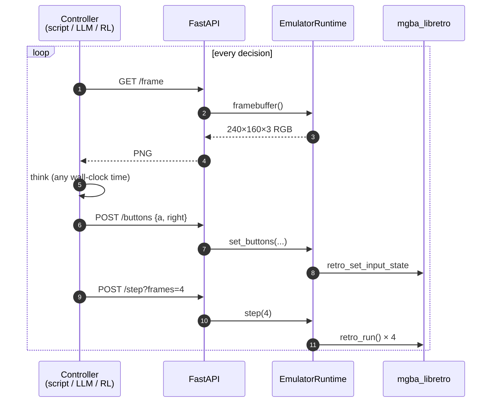

# gbax

[](https://pypi.org/project/gbax/)
[](https://pypi.org/project/gbax/)
[](https://github.com/apiad/gbax/actions/workflows/ci.yml)
[](https://www.mozilla.org/MPL/2.0/)


**A hacker-first GBA emulator. Play with your keyboard, drive it from HTTP.**

`gbax` is a pip-installable Game Boy Advance emulator built for people who like
typing commands. It plays games in a window with a keyboard, like any
emulator — and it also exposes its entire state over a local HTTP API, so any
script, shell pipeline, or LLM in any language can read pixels, peek memory,
and press buttons.

```
$ pip install gbax
$ gbax download "pokemon emerald"
$ gbax play emerald
```

Pokémon Emerald, in a window, with sound, in three commands.

```
$ gbax serve emerald
gbax serving Pokemon - Emerald Version (USA, Europe).gba on http://127.0.0.1:8420
  mode=step  rom_sha1=f3ae088181bf583e55daf962a92bb46f4f1d07b7
  endpoints: /mode /step /speed /frame /buttons /memory /frame_count

$ curl -X POST localhost:8420/buttons -d '{"buttons":["a","right"]}' -H 'content-type: application/json'
$ curl -X POST 'localhost:8420/step?frames=4'
$ curl localhost:8420/frame -o frame.png
```

That's the headline: it's an emulator you can pipe.

> 🤫 Pst, that whole "let's do science on GBA games" is the public reason
> you're here, but we all know you just want to play Pokémon on Linux. Go
> ahead, that's allowed too.

## Status

- **Alpha.** v0.6.0. Works on Linux x86_64 — the wheel bundles the
  libretro core, so `pip install gbax` is a one-step setup. macOS /
  Windows / ARM are PR-welcome.
- **MPL-2.0.** Same license as the underlying mGBA core.
- **No ROMs bundled.** `gbax download` pulls from the public No-Intro mirror
  at archive.org. Use it for games you own; respect your local laws.

## What's here

### Play

`gbax play <rom>` opens an SDL window, wires the keyboard, plays audio.
Pass `--fullscreen` (or `-f`) to skip straight to borderless-desktop
fullscreen at launch.

- D-pad: arrow keys · A: `X` · B: `Z` · L: `A` · R: `S` · Start: Enter · Select: Right-Shift
- `Ctrl+1`…`Ctrl+9` — save state to slot N (auto-persisted to `~/.gbax/saves/<rom-sha1>/`)
- `Shift+1`…`Shift+9` — load slot N
- `Ctrl+R` — toggle macro recording (see [Macros](#macros))
- `F10` — toggle upscale filter (linear ↔ nearest)
- `F11` — toggle borderless-desktop fullscreen
- `F12` — screenshot to `~/.gbax/screenshots/`
- `Tab` (hold) — fast-forward at 8×

The window is resizable; SDL preserves the 3:2 aspect ratio with auto
letterboxing, and the upscale runs through your GPU's bilinear sampler
by default (looks smooth at any size). Hit `F10` for crisp nearest-
neighbor pixels if you prefer the chunky look.

Slots survive restarts. Open a game, save in slot 3, close the window, open the
game again, `Shift+3` — you're back.

### Cheats

```
$ gbax cheats emerald | head -3
  1-hit-kill                           1-Hit Kill
  max-money                            Max Money
  walk-through-walls-l-r               Walk Through Walls [Press L+R]
…

$ gbax play emerald --cheats max-money,walk-through-walls-l-r
cheat ON: Max Money
cheat ON: Walk Through Walls [Press L+R]
```

**Pin cheats to keys** so the same hotkey toggles the same cheat across
sessions:

```
$ gbax pin emerald F1 max-money
$ gbax pin emerald F2 walk-through-walls-l-r
$ gbax pin emerald F7 complete-pokedex
$ gbax pins emerald
  F1  →  max-money
  F2  →  walk-through-walls-l-r
  F7  →  complete-pokedex
```

Pins persist to `~/.gbax/pins/<rom-sha1>.json`. In `play`, pressing `F1`
toggles the pinned cheat directly — autoloading it from the catalog if
needed. Unpinned F-keys fall back to "toggle the Nth currently-active
cheat."

Over the API: `POST /cheats/<slug>/enable`, `POST /cheats/<slug>/disable`,
`POST /cheats/custom` for ad-hoc codes, `DELETE /cheats` to clear.

The libretro-database snapshot (~6700 GameShark / Action Replay / Code
Breaker codes covering 512 GBA games) ships in the wheel — no network at
runtime.

### Macros

Record a button sequence once, replay it whenever you want — without
losing your current state. Useful for grinding routines, in-battle
combos, menu navigation patterns.

```
[in-game]
Ctrl+R                          # start recording
… play your sequence …
Ctrl+R                          # stop; alt-tab to the terminal
bind to which key? [A-Z, 0-9, F1-F9, SPACE, RETURN, BACKSPACE]: H
name (optional): heal-pokemon-center
bound H → heal-pokemon-center

[mid-battle, later]
H                               # replays the recorded sequence
```

Slot universe is any letter A-Z, digit 0-9, F1-F9, plus `SPACE`,
`RETURN`, `BACKSPACE`. The recorder refuses keys already mapped to a
GBA button (X, Z, A, S, Return, Right-Shift, arrows) and the reserved
play-loop hotkeys (`Tab`, `F10`-`F12`). Modifiers are ignored — only
the bare keypress fires a macro, so `Ctrl+R` can never accidentally
trigger an `R` macro.

Macros are scoped per-ROM and persisted to
`~/.gbax/macros/<rom-sha1>/<slot>.json`. List and remove from the CLI:

```
$ gbax macros emerald
  H   →  heal-pokemon-center  (123 frames, recorded 2026-06-10 23:14)
  F5  →  (unnamed)              (47 frames, recorded 2026-06-10 23:21)

$ gbax macro delete emerald H
deleted H (heal-pokemon-center).
```

When a slot has both a cheat pin and a macro, the macro wins. Player
input during replay is merged set-union with the macro's held buttons
— useful if you want to nudge a direction mid-routine, harmless if
you don't.

Note: the record-stop prompt is plain `input()` on the terminal where
you launched gbax. Alt-tab to the terminal to type the slot + name;
the game pauses momentarily.

### Automation: Controller, Scenarios, Tournaments

In-process Python automation. No HTTP needed.

```python
import gbax

with gbax.Controller("pokemon emerald") as g:
    g.press(["start"], frames=2)
    g.wait(60)
    g.press(["a"], frames=2)
    print(g.read_u32(0x02024284))
    g.screenshot("/tmp/run.png")
```

For repeatable runs and tournaments, define a **scenario** (a small Python
file with setup / observe / score / done) and have one or more **players**
race through it:

```bash
$ gbax scenario create "pokemon emerald" --name catch-snorlax
$ gbax train --rom emerald --scenario catch-snorlax --player ./my_bot.py
$ gbax tournament --rom "mortal kombat" \
    --scenario mk-arcade-easy \
    --player "python -m gbax.data.bots.press_a" \
    --player "python -m gbax.data.bots.random"
```

Scenarios choose their own observation shape (raw bytes, structured dict,
framebuffer) and scoring criteria. Two reference scenarios ship in the
wheel: `mk-arcade-easy` (Mortal Kombat Advance ladder) and `smb3-world-1-1`
(Super Mario Advance 4, World 1-1). Full design at
[`docs/automation.md`](docs/automation.md).

### Library

```
$ gbax search "metroid"
    1. Metroid - Zero Mission (USA).zip  (4.0 MB)
    2. Metroid Fusion (USA, Australia).zip  (5.5 MB)
    …

$ gbax download "metroid fusion"
match: Metroid Fusion (USA, Australia).zip
  size: 5.5 MB
  downloading… 100%  (5.5/5.5 MB)
saved: /home/<you>/.gbax/roms/Metroid Fusion (USA, Australia).gba

$ gbax list-roms
  Pokemon - Emerald Version (USA, Europe).gba  (16.0 MB)  sha1:f3ae088181
  Metroid Fusion (USA, Australia).gba          ( 8.0 MB)  sha1:fbe10b78b6
```

Search is instantaneous (~13 ms) — the full 3555-entry No-Intro GBA index ships
in the wheel. `gbax download` is the only thing that touches the network.

### Serve

`gbax serve <rom>` boots the emulator in **step mode** and exposes a FastAPI
control surface on `127.0.0.1:8420`. In step mode the emulator is paused by
default; a controller posts `/step?frames=N` to advance. That's what makes
slow controllers (an LLM that takes 2 seconds to think, an RL agent that runs
in Python) actually viable — the game waits.

```
GET  /mode                                  → "step" | "free"
POST /mode                {mode}              switch
POST /step?frames=N                          advance N frames
POST /speed               {multiplier}        free-run wall-clock speed
GET  /frame_count

GET  /frame                                  PNG of current frame
GET  /frame?fmt=raw                          240×160×3 RGB888 bytes

GET  /buttons                                → ["a","right",…]
POST /buttons             {buttons}           replace held set

GET  /memory?addr=…&len=… → {data: "deadbeef…"}
POST /memory              {addr, data, width} write hex
```

The address space `gbax` exposes is the full GBA bus — IWRAM at `0x03000000`,
EWRAM at `0x02000000`, VRAM at `0x06000000`, OAM, I/O, ROM, BIOS. So a
Pokémon-aware controller can read `0x02024362` and know your party's HP.

Free-run mode (`POST /mode {"mode":"free"}`) advances at wall-clock 60 fps (or
faster with `/speed`), and `/buttons` writes still take effect. Use this when
you want a human at the keyboard *and* a script reading state.

## Architecture


- `LibretroCore` is a ~300-line cffi wrapper around the libretro ABI. It
  dlopens `mgba_libretro.so`, captures the framebuffer + audio + memory-map
  callbacks, drives input. Swapping in another libretro core (vba-next, gpsp)
  is mostly a one-line config change.
- `EmulatorRuntime` is the thread-safe gbax-shaped API on top: load, step,
  framebuffer, memory, save states, free-run ticker.
- The SDL window and the FastAPI server are independent clients of the
  runtime. They don't know about each other.

### Step-mode controller loop

When you `gbax serve`, the emulator is paused. A controller drives it:



The game waits for the controller. That's what makes a 2-second-per-decision
LLM viable, and what makes RL training reproducible.

Why libretro and not mGBA's Python bindings directly? Because the upstream
bindings are brittle on modern toolchains and require building libmgba with a
specific feature set. The libretro ABI is stable, well-documented, and the
core is a single self-contained `.so`. See
[`know-how/building-libretro-core.md`](know-how/building-libretro-core.md).

## Install

```
pip install gbax
```

One command on Linux x86_64 and you're done. The wheel ships a
prebuilt `mgba_libretro.so` inside it, so there's no cmake, no
apt-get, no `$GBAX_CORE_PATH` to set — `gbax play emerald` works on a
fresh box.

The bundled core is built from
[mgba-emu/mgba](https://github.com/mgba-emu/mgba) at the tag pinned in
[`.mgba-version`](.mgba-version) — currently `0.10.5`, MPL-2.0,
upstream license shipped alongside at `gbax/cores/LICENSE.mGBA`. Want
to swap in a debug build, a different mGBA version, or another
libretro core? Point `$GBAX_CORE_PATH` at your own `.so`; the env var
always wins.

Outside Linux x86_64 (macOS, Windows, ARM, ancient glibc) pip falls
through to the sdist, which carries no binary. `gbax play` will exit
at startup with instructions; bring your own core and set
`$GBAX_CORE_PATH`. PRs adding more platform wheels are welcome.

Full coverage in [`docs/installing.md`](docs/installing.md): lookup
order, supported distros, version bumps, compliance.

## Examples

### Pipe the framebuffer into ImageMagick

```
$ gbax serve emerald &
$ for i in $(seq 1 60); do
    curl -s 'localhost:8420/step?frames=1' > /dev/null
    curl -s localhost:8420/frame > frame-$i.png
  done
$ convert -delay 5 frame-*.png loop.gif
```

### Have an LLM play Pokémon

```python
import base64, requests
from openai import OpenAI

g = "http://localhost:8420"

while True:
    requests.post(f"{g}/step?frames=4")
    frame = requests.get(f"{g}/frame").content
    response = OpenAI().chat.completions.create(
        model="gpt-5",
        messages=[{
            "role": "user",
            "content": [
                {"type": "text", "text": "Press one button to make progress."},
                {"type": "image_url", "image_url": {"url": f"data:image/png;base64,{base64.b64encode(frame).decode()}"}},
            ],
        }],
    )
    button = response.choices[0].message.content.strip().lower()
    requests.post(f"{g}/buttons", json={"buttons": [button]})
```

(The LLM rendered above is illustrative — `gbax` makes no assumption about your controller.)

### Read your Pokémon party from a shell

```
$ # EWRAM byte 0x2024284 is the start of the party block in Pokemon Emerald
$ curl -s 'localhost:8420/memory?addr=33718916&len=4' | jq -r .data
01000000
```

## Roadmap

| Status | Slice                                                                         |
| ------ | ----------------------------------------------------------------------------- |
| ✅      | `gbax play` — keyboard + audio + save state slots that survive restarts       |
| ✅      | `gbax serve` — HTTP API for memory / framebuffer / buttons / step / speed     |
| ✅      | ROM library — `search`, `download`, `list-roms` against archive.org           |
| ✅      | Cheat codes — vendored libretro DB (~6700 codes), F1–F9 toggle, `/cheats` API |
| ⏳      | YAML user scripts — `Ctrl+H` runs a sequence of presses + memory pokes        |
| ✅      | Macros — record + replay input sequences via Ctrl+R, bound to any letter/digit/F-key (see [Macros](#macros)) |
| ⏳      | Per-game plugins — Python plugins expose `/state` and `/actions` for Pokémon, etc. |
| ✅      | Bundled libretro core — `pip install gbax` ships a working emulator on Linux x86_64 |
| ✅      | Fullscreen + GPU-accelerated linear upscale (F11), runtime filter toggle (F10) |
| ⏳      | CRT / scanline / hqx shaders via wgpu                                         |
| ⏳      | macOS / Windows / aarch64 wheels                                              |

Full design at `vault/Atlas/Architecture/2026-06-09-gbax-design.md` (in the
companion vault, not this repo).

## Credits

- **[mGBA](https://github.com/mgba-emu/mgba)** by endrift — the emulator core
  doing the actual heavy lifting. MPL-2.0.
- **[No-Intro](https://no-intro.org)** — the canonical ROM-naming and SHA-1
  reference.
- **archive.org** — hosts the No-Intro snapshot we point at by default.
