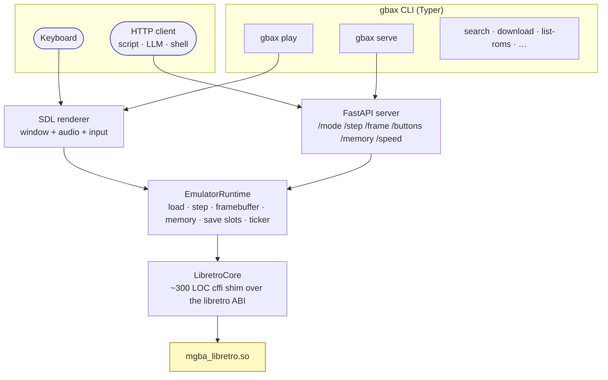
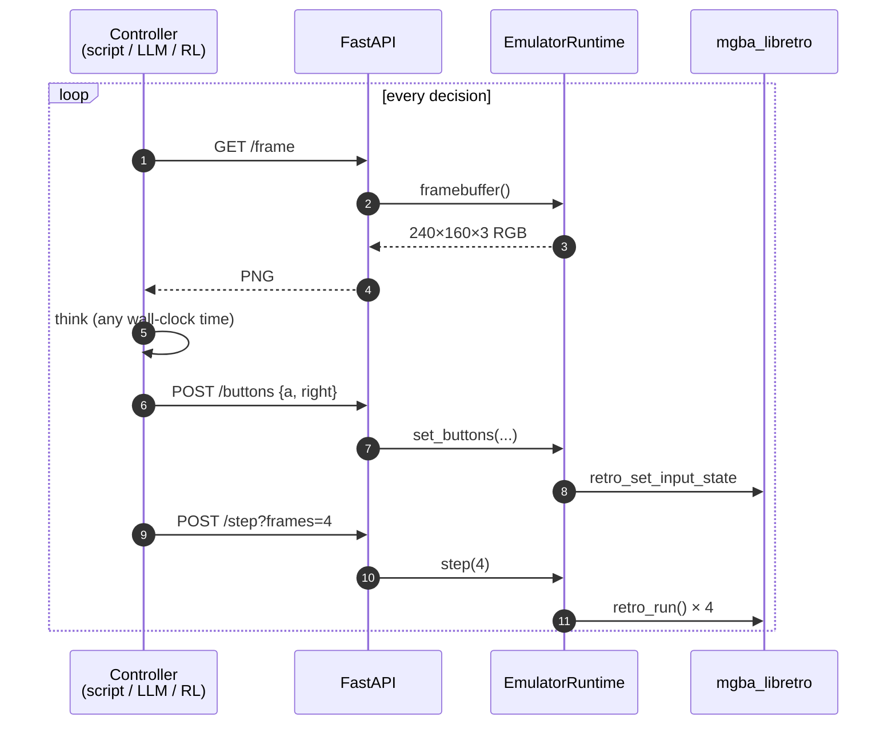

# gbax

**A hacker-first GBA emulator. Play with your keyboard, drive it from HTTP.**

`gbax` is a pip-installable Game Boy Advance emulator built for people who like
typing commands. It plays games in a window with a keyboard, like any
emulator — and it also exposes its entire state over a local HTTP API, so any
script, shell pipeline, or LLM in any language can read pixels, peek memory,
and press buttons.

```
$ pip install gbax
$ gbax download "pokemon emerald"
$ gbax play emerald
```

Pokémon Emerald, in a window, with sound, in three commands.

```
$ gbax serve emerald
gbax serving Pokemon - Emerald Version (USA, Europe).gba on http://127.0.0.1:8420
  mode=step  rom_sha1=f3ae088181bf583e55daf962a92bb46f4f1d07b7
  endpoints: /mode /step /speed /frame /buttons /memory /frame_count

$ curl -X POST localhost:8420/buttons -d '{"buttons":["a","right"]}' -H 'content-type: application/json'
$ curl -X POST 'localhost:8420/step?frames=4'
$ curl localhost:8420/frame -o frame.png
```

That's the headline: it's an emulator you can pipe.

## Status

- **Alpha.** v0.0.1. Works on Linux. macOS / Windows are PR-welcome.
- **MPL-2.0.** Same license as the underlying mGBA core.
- **No ROMs bundled.** `gbax download` pulls from the public No-Intro mirror
  at archive.org. Use it for games you own; respect your local laws.

## What's here

### Play

`gbax play <rom>` opens an SDL window, wires the keyboard, plays audio.

- D-pad: arrow keys · A: `X` · B: `Z` · L: `A` · R: `S` · Start: Enter · Select: Right-Shift
- `Ctrl+1`…`Ctrl+9` — save state to slot N (auto-persisted to `~/.gbax/saves/<rom-sha1>/`)
- `Shift+1`…`Shift+9` — load slot N
- `F12` — screenshot to `~/.gbax/screenshots/`
- `Tab` (hold) — fast-forward at 8×

Slots survive restarts. Open a game, save in slot 3, close the window, open the
game again, `Shift+3` — you're back.

### Library

```
$ gbax search "metroid"
    1. Metroid - Zero Mission (USA).zip  (4.0 MB)
    2. Metroid Fusion (USA, Australia).zip  (5.5 MB)
    …

$ gbax download "metroid fusion"
match: Metroid Fusion (USA, Australia).zip
  size: 5.5 MB
  downloading… 100%  (5.5/5.5 MB)
saved: /home/<you>/.gbax/roms/Metroid Fusion (USA, Australia).gba

$ gbax list-roms
  Pokemon - Emerald Version (USA, Europe).gba  (16.0 MB)  sha1:f3ae088181
  Metroid Fusion (USA, Australia).gba          ( 8.0 MB)  sha1:fbe10b78b6
```

Search is instantaneous (~13 ms) — the full 3555-entry No-Intro GBA index ships
in the wheel. `gbax download` is the only thing that touches the network.

### Serve

`gbax serve <rom>` boots the emulator in **step mode** and exposes a FastAPI
control surface on `127.0.0.1:8420`. In step mode the emulator is paused by
default; a controller posts `/step?frames=N` to advance. That's what makes
slow controllers (an LLM that takes 2 seconds to think, an RL agent that runs
in Python) actually viable — the game waits.

```
GET  /mode                                  → "step" | "free"
POST /mode                {mode}              switch
POST /step?frames=N                          advance N frames
POST /speed               {multiplier}        free-run wall-clock speed
GET  /frame_count

GET  /frame                                  PNG of current frame
GET  /frame?fmt=raw                          240×160×3 RGB888 bytes

GET  /buttons                                → ["a","right",…]
POST /buttons             {buttons}           replace held set

GET  /memory?addr=…&len=… → {data: "deadbeef…"}
POST /memory              {addr, data, width} write hex
```

The address space `gbax` exposes is the full GBA bus — IWRAM at `0x03000000`,
EWRAM at `0x02000000`, VRAM at `0x06000000`, OAM, I/O, ROM, BIOS. So a
Pokémon-aware controller can read `0x02024362` and know your party's HP.

Free-run mode (`POST /mode {"mode":"free"}`) advances at wall-clock 60 fps (or
faster with `/speed`), and `/buttons` writes still take effect. Use this when
you want a human at the keyboard *and* a script reading state.

## Architecture



- `LibretroCore` is a ~300-line cffi wrapper around the libretro ABI. It
  dlopens `mgba_libretro.so`, captures the framebuffer + audio + memory-map
  callbacks, drives input. Swapping in another libretro core (vba-next, gpsp)
  is mostly a one-line config change.
- `EmulatorRuntime` is the thread-safe gbax-shaped API on top: load, step,
  framebuffer, memory, save states, free-run ticker.
- The SDL window and the FastAPI server are independent clients of the
  runtime. They don't know about each other.

### Step-mode controller loop

When you `gbax serve`, the emulator is paused. A controller drives it:



The game waits for the controller. That's what makes a 2-second-per-decision
LLM viable, and what makes RL training reproducible.

Why libretro and not mGBA's Python bindings directly? Because the upstream
bindings are brittle on modern toolchains and require building libmgba with a
specific feature set. The libretro ABI is stable, well-documented, and the
core is a single self-contained `.so`. See
[`know-how/building-libretro-core.md`](know-how/building-libretro-core.md).

## Install

```
pip install gbax
```

You also need the libretro mGBA core (`mgba_libretro.so`). The wheel doesn't
bundle it yet — for now, build it from source:

```bash
git clone --depth=1 https://github.com/mgba-emu/mgba.git /tmp/mgba
cd /tmp/mgba && mkdir build && cd build
cmake .. \
  -DBUILD_QT=OFF -DBUILD_SDL=OFF -DBUILD_LIBRETRO=ON \
  -DBUILD_SHARED=OFF -DBUILD_STATIC=OFF \
  -DUSE_LUA=OFF -DUSE_FREETYPE=OFF -DUSE_DISCORD_RPC=OFF \
  -DUSE_LIBZIP=OFF -DBUILD_LTO=OFF -DCMAKE_BUILD_TYPE=Release
make mgba_libretro -j$(nproc)

mkdir -p ~/.gbax/cores
cp mgba_libretro.so ~/.gbax/cores/
export GBAX_CORE_PATH=~/.gbax/cores/mgba_libretro.so
```

System packages needed: `cmake build-essential libsdl2-dev libpng-dev
libsqlite3-dev`. Then re-run `pip install gbax`.

The full procedure (including why each flag matters) is in
[`know-how/building-libretro-core.md`](know-how/building-libretro-core.md).

## Examples

### Pipe the framebuffer into ImageMagick

```
$ gbax serve emerald &
$ for i in $(seq 1 60); do
    curl -s 'localhost:8420/step?frames=1' > /dev/null
    curl -s localhost:8420/frame > frame-$i.png
  done
$ convert -delay 5 frame-*.png loop.gif
```

### Have an LLM play Pokémon

```python
import base64, requests
from openai import OpenAI

g = "http://localhost:8420"

while True:
    requests.post(f"{g}/step?frames=4")
    frame = requests.get(f"{g}/frame").content
    response = OpenAI().chat.completions.create(
        model="gpt-5",
        messages=[{
            "role": "user",
            "content": [
                {"type": "text", "text": "Press one button to make progress."},
                {"type": "image_url", "image_url": {"url": f"data:image/png;base64,{base64.b64encode(frame).decode()}"}},
            ],
        }],
    )
    button = response.choices[0].message.content.strip().lower()
    requests.post(f"{g}/buttons", json={"buttons": [button]})
```

(The LLM rendered above is illustrative — `gbax` makes no assumption about your controller.)

### Read your Pokémon party from a shell

```
$ # EWRAM byte 0x2024284 is the start of the party block in Pokemon Emerald
$ curl -s 'localhost:8420/memory?addr=33718916&len=4' | jq -r .data
01000000
```

## Roadmap

| Status | Slice                                                                         |
| ------ | ----------------------------------------------------------------------------- |
| ✅      | `gbax play` — keyboard + audio + save state slots that survive restarts       |
| ✅      | `gbax serve` — HTTP API for memory / framebuffer / buttons / step / speed     |
| ✅      | ROM library — `search`, `download`, `list-roms` against archive.org           |
| ⏳      | Cheat codes — libretro cheat DB + `Ctrl+H` toggle + `/cheats` API             |
| ⏳      | YAML user scripts — `Ctrl+H runs a sequence of presses + memory pokes`        |
| ⏳      | Recording / replay — deterministic input log + divergence detection           |
| ⏳      | Per-game plugins — Python plugins expose `/state` and `/actions` for Pokémon, etc. |
| ⏳      | macOS / Windows wheels                                                        |

Full design at `vault/Atlas/Architecture/2026-06-09-gbax-design.md` (in the
companion vault, not this repo).

## Credits

- **[mGBA](https://github.com/mgba-emu/mgba)** by endrift — the emulator core
  doing the actual heavy lifting. MPL-2.0.
- **[No-Intro](https://no-intro.org)** — the canonical ROM-naming and SHA-1
  reference.
- **archive.org** — hosts the No-Intro snapshot we point at by default.
